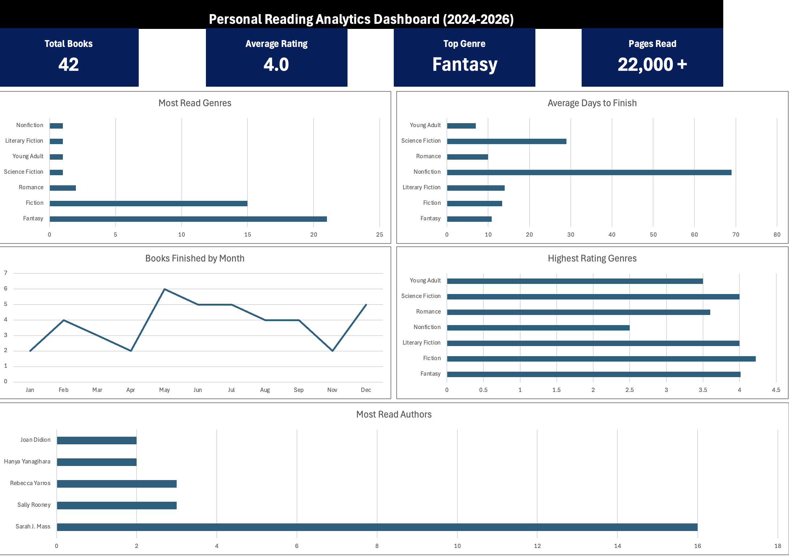

# Reading Analytics Dashboard

## Overview
This project analyzes personal reading habits from 2024-2026 using Excel.

The dahsboard tracks:
- Most read genres
- Higest rated genres
- Books finished by month
- Average days to finish books
- Most read authors
- KPI metrics such as total books and pages read

## Tools Used
- Microsoft Excel
- Pivot Tables
- Pivot Charts
- KPI Cards
- Data Cleaning
- Dashboard Design

## Goals
The goal of this project was to practice data visualization, dashboard building, and analytical reporting using a personally curated dataset.

## Key Insights
- Fantasy was the most frequently read genre
- Reading activity peaked during summer months
- Sarah J. Maas was the most read author
- Average ratings remained consistently high across fiction genres
